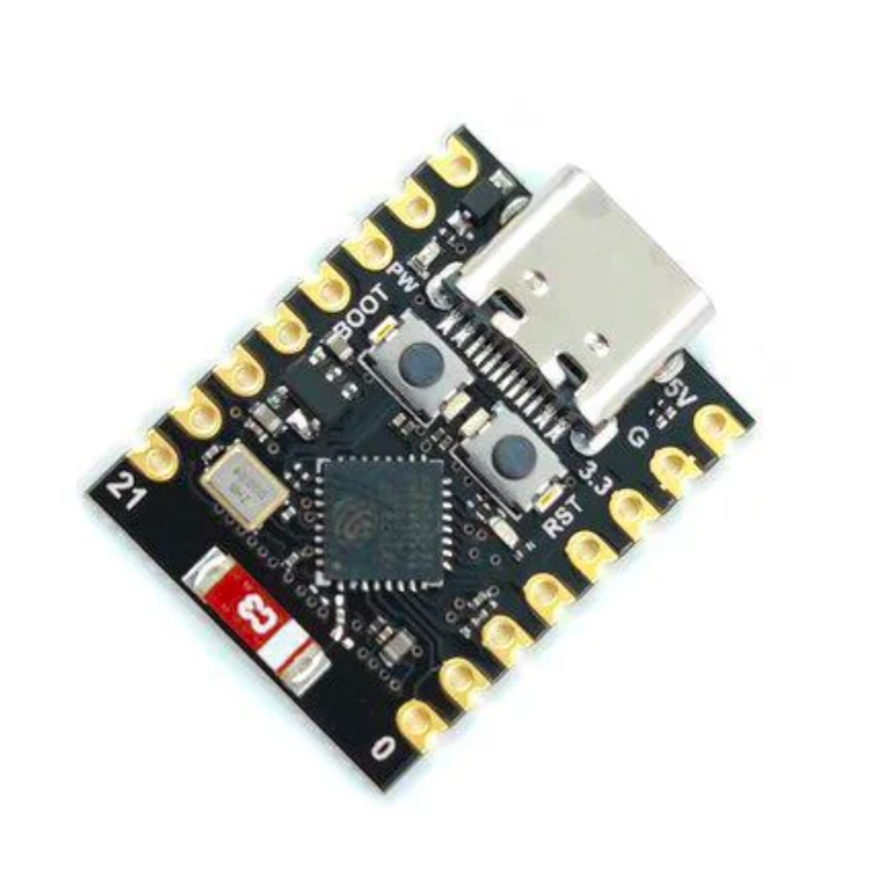
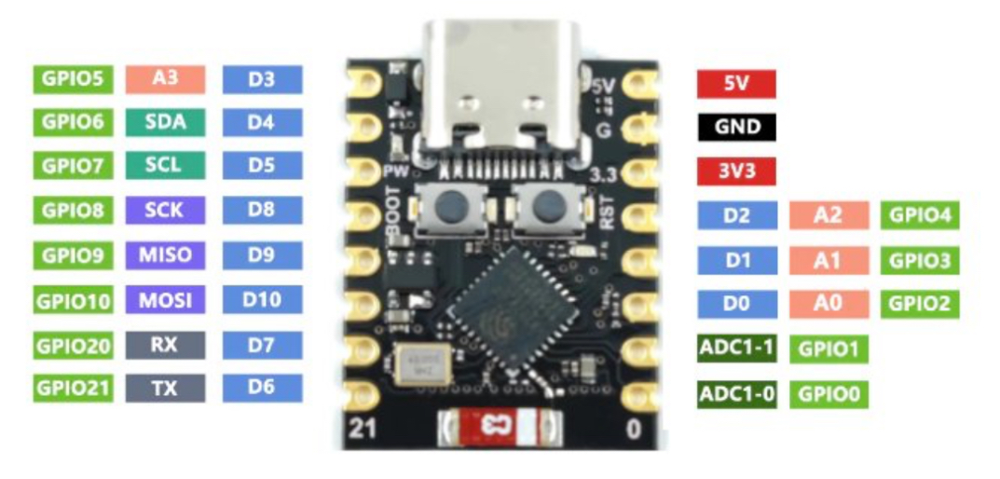

[](https://github.com/hasenradball/ESP32-C3-Examples/actions/workflows/compile_examples.yml)

# ESP32-C3-Examples
Code Examples for the Espressif ESP32-C3 SoC.



List of content<br>
* [ESP32-C3-Exampes](#esp32-c3-examples)
   * [About](#about)<br>
   * [Installation](#installation)<br>
   * [PlatformIo Configuration](#platformio-configuration)<br>
      * [Arduino core v3.x](#arduino-core-v3x)
      * [Arduino core v2.x](#arduino-core-v2x)
   * [Pinmap](#pinmap)<br>
   * [Compatibility](#compatibility)<br>
* [Copyright](#copyright)<br>
* [License](#license)<br>
# [Helpful Links](#helpful-links)<br>


## About
This repository is a collection of examples for the espressif ESP32-C3 SoC.

It is structured in a way that you find a empty `main.cpp` file, because it is not a specific repository. Instead you find all examples in the examples folder.

From there you can copy an past the code easily to the `main.cpp` file

## Installation
You can install/clone the repo by th following command.

```
git clone https://github.com/hasenradball/ESP32-C3-Examples.git
```
After the cloning the repository please do the following on your local repo to prevent the files to be tracked and pushed.

```
git update-index --assume-untracked src/main.cpp
git update-index --assume-untracked include/wifi_secrets.h
```

## PlatformIO Configuration
The focus for this repository is to use the Arduino Core for ESP32 v3.x. Therefore it is reccomended to use the Configuration for Arduino core v3.x.
With v3.x there are some braking changes which means that not all examples will directly run on v2.x and need code adaption.

### Arduino Core v3.x
For the usage of the Arduino Core v3.0.7 the following configuration should be used.

```
[env:esp32-c3-devkitm-1]
board = esp32-c3-devkitm-1
platform = espressif32

platform_packages =
    platformio/framework-arduinoespressif32 @ https://github.com/espressif/arduino-esp32.git#3.0.7
    platformio/framework-arduinoespressif32-libs @ https://github.com/espressif/esp32-arduino-lib-builder/releases/download/idf-release_v5.1/esp32-arduino-libs-idf-release_v5.1-632e0c2a.zip

framework = arduino
build_flags = 
    -DARDUINO_USB_CDC_ON_BOOT=1
    -DARDUINO_USB_MODE=1
```
### Arduino Core v2.x
For the usage of the Arduino Core v3.0.7 the following configuration should be used.

```
[env:esp32-c3-devkitm-1]
board = esp32-c3-devkitm-1

platform = espressif32

framework = arduino
build_flags = 
    -DARDUINO_USB_CDC_ON_BOOT=1
    -DARDUINO_USB_MODE=1
```

## Pinmap


## Compatibility
Tested with:
* ESP32
* ESP32-C3

# Helpful Links
[ESP32-c3 Datasheet](https://www.google.com/url?sa=t&source=web&rct=j&opi=89978449&url=https://www.espressif.com/sites/default/files/documentation/esp32-c3_datasheet_en.pdf&ved=2ahUKEwiG2ZaWs_SJAxXsBtsEHRFMEfEQFnoECAkQAQ&usg=AOvVaw1dZ6MY4KZrOkUy9TYhe5BK)

[//]: # (# Copyright)

# License
This library is licensed under MIT Licence.

[ESP32-C3 Examples licence](https://github.com/hasenradball/ESP32-C3-Examples/blob/main/LICENSE)

[back to top](#esp32-c3-examples)
