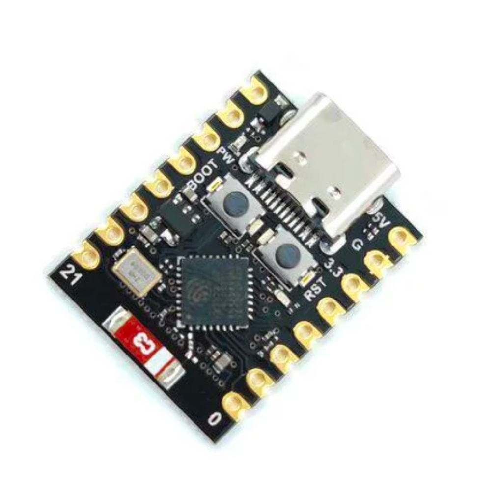
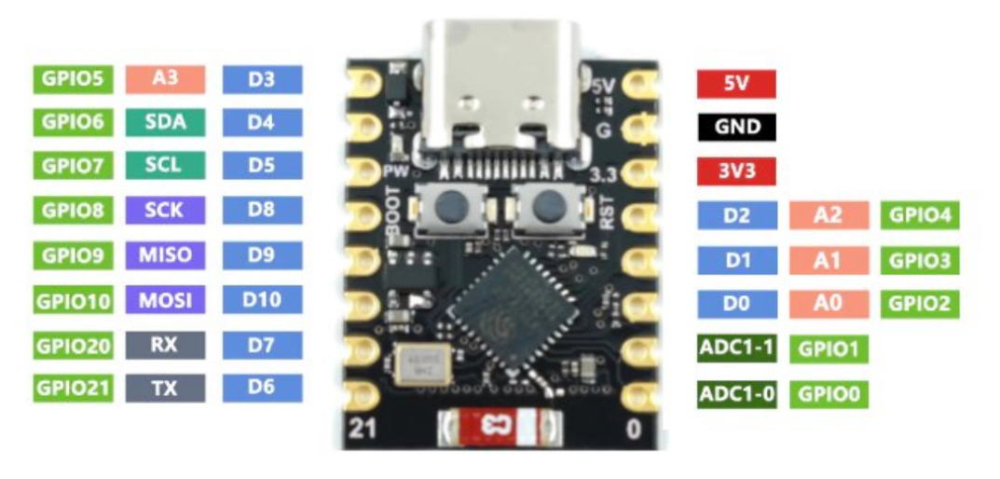

[](https://github.com/hasenradball/ESP32-C3-Examples/actions/workflows/spell_checker.yml)
[](https://github.com/hasenradball/ESP32-C3-Examples/actions/workflows/compile_examples.yml)

# ESP32-C3-Examples
Code Examples for the Espressif ESP32-C3 SoC.



List of content<br>
* [ESP32-C3-Exampes](#esp32-c3-examples)
   * [About](#about)<br>
   * [Installation](#installation)<br>
   * [PlatformIo Configuration](#platformio-configuration)<br>
      * [Arduino core latest](#arduino-core-latest-with-pioarduino
      * [Arduino core v3.x](#arduino-core-v3x-deprecated
   * [Pinmap](#pinmap)<br>
   * [Compatibility](#compatibility)<br>
* [Copyright](#copyright)<br>
* [License](#license)<br>
* [Helpful Links](#helpful-links)<br>


## About
This repository is a collection of examples for the espressif ESP32-C3 SoC.

It is structured in a way that you find a empty `main.cpp` file, because it is not a specific repository. Instead you find all examples in the examples folder.

From there you can copy an past the code easily to the `main.cpp` file

## Installation
You can install/clone the repo by th following command.

```
git clone https://github.com/hasenradball/ESP32-C3-Examples.git
```
After the cloning the repository please do the following on your local repo to prevent the files to be tracked and pushed.

```
git update-index --assume-untracked src/main.cpp
git update-index --assume-untracked include/wifi_secrets.h
```

## pioarduino Configuration
The focus for this repository is to use the latest Arduino Core for ESP32. Therefore it is recommended to use the Configuration for Arduino core:<br>[arduino-esp32](https://github.com/espressif/arduino-esp32)<br>
With Core v3.x there are some braking changes which means that not all examples will directly run on like on Core v2.x and need code adaption.

### Arduino Core latest (with pioarduino)
For the usage of the lastest Arduino Core the following configuration should be used.

```
[env]
platform = https://github.com/pioarduino/platform-espressif32/releases/download/stable/platform-espressif32.zip
board_build.filesystem = littlefs

[env:nologo_esp32c3_super_mini]
board = nologo_esp32c3_super_mini
framework = arduino
build_flags =
   -std=c++17
   -Wall
   -Wextra
;   -Werror
```

### Arduino Core v3.x (deprecated)
For the usage of the Arduino Core v3.0.7 the following configuration should be used.

```
[env:esp32-c3-devkitm-1]
board = esp32-c3-devkitm-1
platform = espressif32

platform_packages =
    platformio/framework-arduinoespressif32 @ https://github.com/espressif/arduino-esp32.git#3.0.7
    platformio/framework-arduinoespressif32-libs @ https://github.com/espressif/esp32-arduino-lib-builder/releases/download/idf-release_v5.1/esp32-arduino-libs-idf-release_v5.1-632e0c2a.zip

framework = arduino
build_flags = 
    -DARDUINO_USB_CDC_ON_BOOT=1
    -DARDUINO_USB_MODE=1
```


## Pinmap


See also file `variants/<your-board>/pins_arduino.h`, here as example for the board `nologoesp32c3_super_mini`.
```
#ifndef Pins_Arduino_h
#define Pins_Arduino_h

#include <stdint.h>

static const uint8_t LED_BUILTIN = 8;
#define BUILTIN_LED LED_BUILTIN  // backward compatibility
#define LED_BUILTIN LED_BUILTIN  // allow testing #ifdef LED_BUILTIN

static const uint8_t TX = 21;
static const uint8_t RX = 20;

static const uint8_t SDA = 8;
static const uint8_t SCL = 9;

static const uint8_t SS = 7;
static const uint8_t MOSI = 6;
static const uint8_t MISO = 5;
static const uint8_t SCK = 4;

static const uint8_t A0 = 0;
static const uint8_t A1 = 1;
static const uint8_t A2 = 2;
static const uint8_t A3 = 3;
static const uint8_t A4 = 4;
static const uint8_t A5 = 5;

#endif /* Pins_Arduino_h */
```

## Compatibility
Tested with:
* ESP32
* ESP32-C3

# Helpful Links
[ESP32-c3 Datasheet](https://www.google.com/url?sa=t&source=web&rct=j&opi=89978449&url=https://www.espressif.com/sites/default/files/documentation/esp32-c3_datasheet_en.pdf&ved=2ahUKEwiG2ZaWs_SJAxXsBtsEHRFMEfEQFnoECAkQAQ&usg=AOvVaw1dZ6MY4KZrOkUy9TYhe5BK)

[ESP32-C3 SuperMini Turorials](https://github.com/sidharthmohannair/Tutorial-ESP32-C3-Super-Mini)

[//]: # (# Copyright)

# License
This library is licensed under MIT Licence.

[ESP32-C3 Examples licence](https://github.com/hasenradball/ESP32-C3-Examples/blob/main/LICENSE)

[back to top](#esp32-c3-examples)
